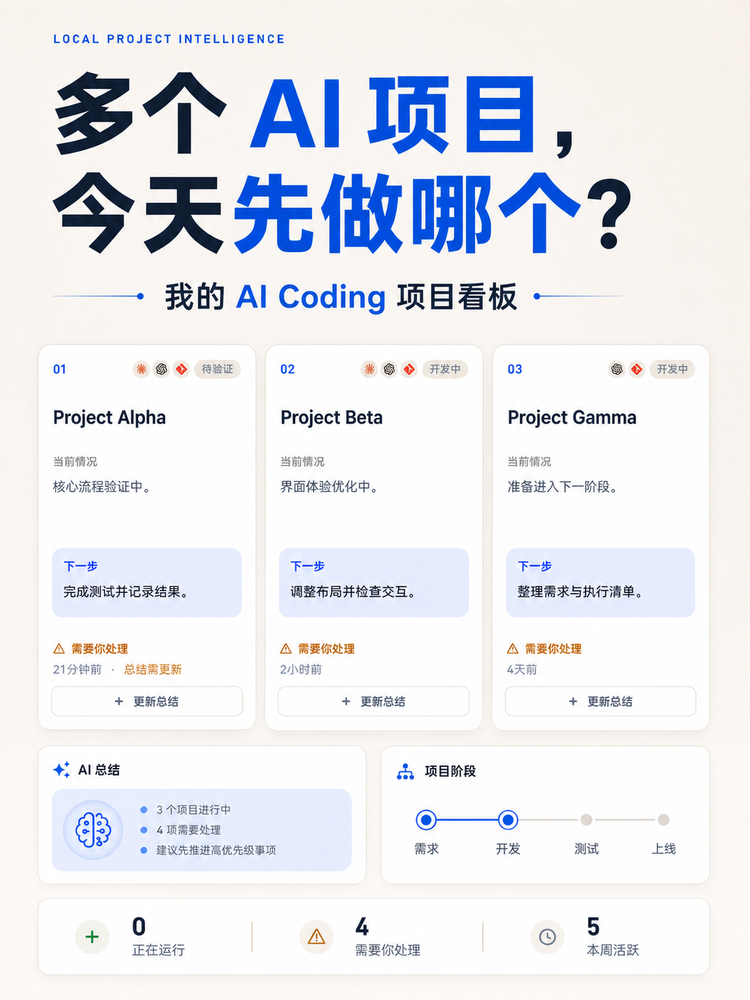
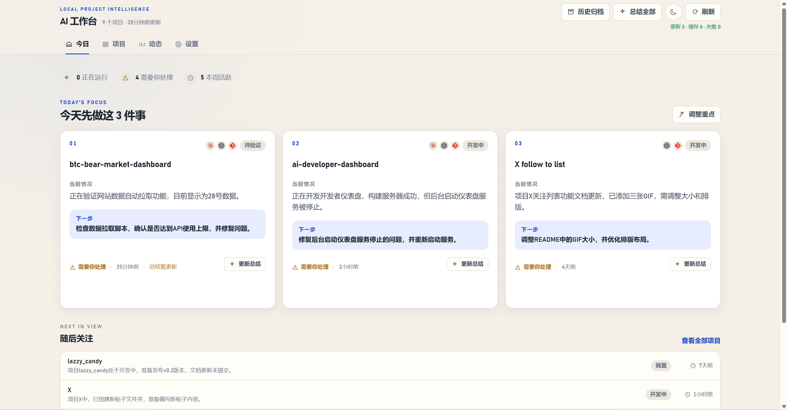
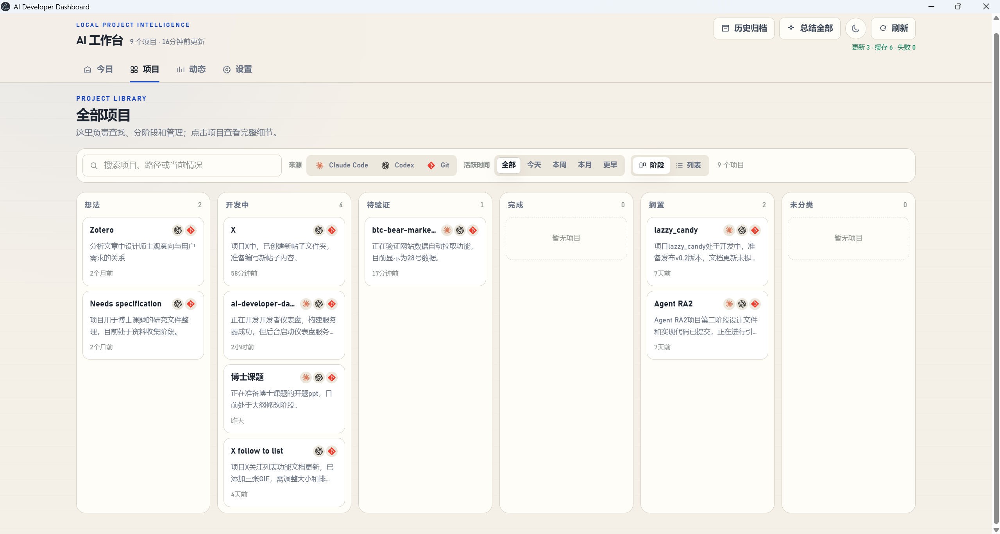

# AI Developer Dashboard

面向 Claude Code、OpenAI Codex 和 Git 用户的本地优先 Windows 和 macOS AI 编程项目管理工具。它把分散在多个项目和编程助手里的进度汇总到一个桌面工作台，帮助你决定今天先做什么。

[**⬇️ 下载桌面版（Windows / macOS）**](https://github.com/DrErwin/ai-developer-dashboard/releases/latest) · [English](#english)

  

## AI Developer Dashboard 是什么？

同时使用 Claude Code、Codex 和 Git 时，你可能需要逐个打开项目，才能判断哪个项目还在运行、最近改了什么、下一步该做什么。

AI Developer Dashboard 读取这些工具留在本机的项目活动，把同一路径的信息合并成项目卡、阶段看板和时间线。你可以在一个桌面软件里查看项目状态、整理今日重点，并按需生成 AI 项目总结。

## 它能做什么？

| 功能 | 用途 |
|---|---|
| 今日重点 | 从多个项目中选择、排序和管理今天要推进的项目。 |
| 项目看板 | 汇总 Claude Code、Codex 和 Git 状态，并按阶段查看项目。 |
| 动态时间线 | 按来源、项目和时间范围筛选最近活动。 |
| AI 项目总结 | 按需生成项目阶段、下一步、阻塞项和关注状态。 |
| 本地管理 | 保存阶段、归档、筛选、主题、刷新频率和模型设置。 |

普通的项目浏览和管理不需要 AI 模型。AI 总结支持智谱 GLM，以及使用 OpenAI Chat Completions 兼容接口的模型服务。

## 三个核心视图

### 🎯 今天先做什么

“今天”页面从多个项目中整理出最多三项重点工作。每张卡片显示项目来源、当前阶段、当前情况和下一步，让你先处理需要关注的工作，也可以手动调整顺序或更换重点。

  

### ✨ AI 总结

你可以为单个项目更新总结，也可以批量总结全部项目。AI 总结根据近期项目活动提炼当前情况、下一步、阻塞项和关注状态，并把结果放回项目卡片。相同输入会使用已有缓存，减少重复调用。

### 🗂️ 项目阶段进度面板

阶段面板把项目放进想法、开发中、待验证、完成、搁置或未分类。你可以搜索项目，按 Claude Code、Codex、Git 来源和活跃时间筛选，并直接调整项目阶段。

  

## 下载、安装和打开

### Windows

1. 打开 [GitHub Releases 最新版页面](https://github.com/DrErwin/ai-developer-dashboard/releases/latest)。
2. 在 **Assets** 中下载适用于 Windows x64 的 `.exe` 安装包。
3. 双击安装包，按提示完成安装。
4. 从桌面快捷方式或开始菜单打开 **AI Developer Dashboard**。

### macOS

1. 打开 [GitHub Releases 最新版页面](https://github.com/DrErwin/ai-developer-dashboard/releases/latest)。
2. 在 **Assets** 中下载 macOS universal 的 `.dmg` 安装包；它同时支持 Apple Silicon 和 Intel Mac。
3. 打开 `.dmg`，把 **AI Developer Dashboard** 拖到 **Applications** 文件夹。
4. 从 Applications 打开应用。

> [!NOTE]
> 普通用户不需要安装开发环境，也不需要使用终端、CLI、浏览器地址或端口。macOS 构建未签名、未公证；首次打开如被 Gatekeeper 阻止，请在 Finder 中按住 Control 点按应用并选择“打开”，或在“系统设置 → 隐私与安全性”中允许打开。

> [!NOTE]
> 应用需要读取项目目录，macOS 会对「文稿」「桌面」「下载」三类受保护文件夹各弹一次授权（按类别算，不按项目数量，最多 3 次），逐一点“允许”即可。想一劳永逸：在“系统设置 → 隐私与安全性 → 完全磁盘访问权限”中加入 AI Developer Dashboard，一次授权后不再弹窗。如果误点了“不允许”，对应文件夹里项目的 Git 状态会缺失，可在“系统设置 → 隐私与安全性 → 文件与文件夹 → AI Developer Dashboard”中重新勾选。未签名应用偶尔记不住授权，在上述设置页手动勾选一次即可根治。

## 它如何整理项目？

软件读取本机的 Claude Code 与 Codex 活动记录，并结合各项目的 Git 分支、提交和工作区状态。相同路径的记录会合并到同一张项目卡。

你可以手动调整项目阶段、今日重点和归档状态。刷新功能更新本机项目状态；只有你主动请求 AI 总结时，软件才会调用你配置的模型服务。

## 🔒 本地数据、API Key 和 AI 总结

软件把项目状态、偏好设置和 API Key 保存在你的电脑上。安装、升级、卸载和重装不会主动删除这些个人数据。

软件不会把项目源文件上传到本项目的服务器。你请求 AI 总结时，它会把有限的项目上下文发送给你配置的模型服务，其中可能包括截断后的项目说明、近期对话片段、Git 分支与提交信息、工作区变更数量和少量文件名。

设置页会显示当前模型提供商已保存的 API Key，方便你检查或修改。输入框旁的眼睛按钮可以把 Key 切换为星号。分享屏幕或反馈问题前，请先隐藏 Key。

## ❓ 常见问题

### 这是 Claude Code 和 Codex 的项目看板吗？

是。它把 Claude Code、OpenAI Codex 和 Git 的本机项目活动汇总到同一个 Windows 或 macOS 桌面看板中。

### 不配置 API Key 可以使用吗？

可以。项目列表、今日重点、阶段、动态、归档和本地设置都能使用。只有 AI 项目总结需要模型服务和 API Key。

### 软件会上传我的源代码吗？

软件不会上传项目源文件。你主动请求 AI 总结时，有限的项目上下文会发送给你选择的模型服务，具体范围见上方的数据说明。

### 数据保存在哪里？

桌面版把个人数据保存在当前系统用户的应用数据目录中，不放在软件安装目录。卸载软件时默认保留这些数据。

### 如何获得新版本？

前往 [Latest Release](https://github.com/DrErwin/ai-developer-dashboard/releases/latest) 下载新的 Windows `.exe` 或 macOS `.dmg` 安装包。项目目前不提供自动更新。

---

## English

AI Developer Dashboard is a local-first Windows and macOS project management tool for developers who use Claude Code, OpenAI Codex, and Git. It brings activity from multiple projects and coding agents into one desktop workspace so you can decide what to work on today.

[**⬇️ Download the desktop app for Windows or macOS**](https://github.com/DrErwin/ai-developer-dashboard/releases/latest) · [中文](#ai-developer-dashboard)

## What is AI Developer Dashboard?

Claude Code, Codex, and Git keep useful project signals in different places. Checking each project takes time when you need to find active work, recent changes, blockers, or the next step.

AI Developer Dashboard reads local activity from these tools and merges records that point to the same project path. It presents the result as project cards, a stage board, and an activity timeline. You can manage today's priorities and request an AI project summary from the same desktop app.

## What can it do?

| Feature | Purpose |
|---|---|
| Today focus | Select, order, and manage the projects you want to move forward today. |
| Project board | Combine Claude Code, Codex, and Git status and view projects by stage. |
| Activity timeline | Filter recent activity by source, project, and time range. |
| AI project summaries | Generate a project stage, next step, blockers, and attention state on demand. |
| Local management | Store stages, archives, filters, theme, refresh interval, and model settings. |

Project browsing and management work without an AI model. AI summaries support Zhipu GLM and model services with an OpenAI Chat Completions-compatible endpoint.

## Three core views

### 🎯 Decide what to work on today

The Today page selects up to three focus projects from your workspace. Each card shows its sources, stage, current situation, and next step. You can reorder the cards or replace a focus project when your priorities change.

### ✨ AI project summaries

You can refresh one project summary or summarize all projects in a batch. The model turns recent project activity into a current situation, next step, blockers, and attention state, then returns the result to the project card. The app reuses cached results when the summary input has not changed.

### 🗂️ Project stage progress board

The stage board groups projects into Idea, In Development, To Verify, Complete, Shelved, or Unclassified. You can search projects, filter them by Claude Code, Codex, Git source and activity period, and change a project's stage from the board.

## Download, install, and open the app

### Windows

1. Open the [latest GitHub Release](https://github.com/DrErwin/ai-developer-dashboard/releases/latest).
2. Under **Assets**, download the `.exe` installer for Windows x64.
3. Run the installer and follow its prompts.
4. Open **AI Developer Dashboard** from the desktop shortcut or Start menu.

### macOS

1. Open the [latest GitHub Release](https://github.com/DrErwin/ai-developer-dashboard/releases/latest).
2. Under **Assets**, download the universal macOS `.dmg` installer. It supports both Apple Silicon and Intel Macs.
3. Open the `.dmg` and drag **AI Developer Dashboard** to **Applications**.
4. Open the application from Applications.

> [!NOTE]
> You do not need a development environment, terminal, CLI command, browser address, or port for normal use. The macOS build is intentionally unsigned and not notarized. If Gatekeeper blocks its first launch, Control-click the app in Finder and choose Open, or allow it under System Settings → Privacy & Security.

> [!NOTE]
> The app reads project directories, so macOS asks once per protected folder category — Documents, Desktop, Downloads (per category, not per project; at most 3 prompts). Click OK for each. To skip prompts entirely, add AI Developer Dashboard under System Settings → Privacy & Security → Full Disk Access once. If you clicked Don't Allow by mistake, Git status will be missing for projects in that folder; re-enable it under System Settings → Privacy & Security → Files and Folders → AI Developer Dashboard. Unsigned apps occasionally fail to remember the choice; ticking it once in that settings pane fixes it permanently.

## How does it organize projects?

The app reads local Claude Code and Codex activity and combines it with Git branch, commit, and worktree status. Records with the same project path become one project card.

You control project stages, today's focus, and archives. Refreshing updates local project state. The app contacts your configured model service only when you request an AI summary.

## 🔒 Local data, API Keys, and AI summaries

The app stores project state, preferences, and API Keys on your computer. Installing, upgrading, uninstalling, or reinstalling the app does not delete this personal data by default.

The app does not upload project source files to a server operated by this project. When you request an AI summary, it sends limited project context to the model service you configured. That context may include truncated project instructions, recent conversation excerpts, Git branch and commit details, worktree change counts, and a small set of filenames.

The Settings page displays the saved API Key for the current model provider so you can inspect or edit it. Use the eye button beside the field to replace the Key with asterisks before screen sharing or sending feedback.

## ❓ Frequently asked questions

### Is this a project dashboard for Claude Code and Codex?

Yes. It combines local activity from Claude Code, OpenAI Codex, and Git in one Windows or macOS desktop dashboard.

### Can I use it without an API Key?

Yes. The project list, Today focus, stages, activity, archives, and local settings work without a model. Only AI project summaries require a model service and API Key.

### Does it upload my source code?

The app does not upload project source files. When you request an AI summary, it sends limited project context to your chosen model service as described above.

### Where does it store my data?

The desktop app stores personal data under the current user's application data directory, outside the installation folder. Uninstalling the app keeps this data by default.

### Where can I get a new version?

Download new Windows `.exe` or macOS `.dmg` installers from the [Latest Release](https://github.com/DrErwin/ai-developer-dashboard/releases/latest). The app does not provide automatic updates at this stage.
